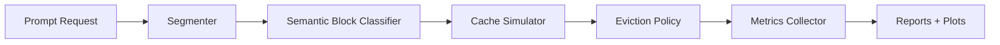

# SemanticKV

SemanticKV is a production-style LLM serving/cache infrastructure project that simulates semantic-aware prefix/KV-cache eviction under memory pressure. It segments prompts into semantic blocks, compares FIFO/LRU/LFU/size-aware/static/adaptive policies, records simulated serving metrics, and generates reproducible reports and plots. This is not a chatbot; it is an evaluation harness and FastAPI middleware MVP for studying cache behavior in LLM serving systems.

All TTFT values are simulated estimates, not measured GPU latency:

```text
estimated_ttft_ms = base_ttft_ms + uncached_prompt_tokens * token_latency_ms
```

## Architecture



Core components:

- `semantic_kv/cache`: prefix-cache simulator, cache state, Pydantic models
- `semantic_kv/policies`: FIFO, LRU, LFU, size-aware LRU, static semantic, adaptive semantic
- `semantic_kv/segmentation`: rule-based prompt segmentation and semantic classification
- `semantic_kv/workloads`: deterministic synthetic serving workloads
- `semantic_kv/experiments`: experiment runner, reports, aggregate summaries
- `apps/api`: FastAPI service for interactive simulation

## Why Semantic-Aware Eviction?

Prefix/KV caching avoids recomputing shared prompt prefixes during the prefill phase of LLM inference. Under constrained cache memory, eviction policy determines whether reusable blocks stay resident or get displaced by one-off prompt text.

Traditional policies treat prompt blocks uniformly:

- `LRU` works well when recent reuse predicts future reuse.
- `LFU` works well when exact frequent blocks dominate.
- `FIFO` is simple but blind to reuse value.
- Size-aware LRU accounts for block cost but not semantic role.

SemanticKV tests a more serving-aware thesis: system prompts, templates, retrieved context, tool outputs, code snippets, legal evidence, assistant history, and one-off user queries have different reuse patterns. A policy that combines semantic type, reuse feedback, recency, frequency, estimated prefill savings, and memory cost can make better eviction decisions in some workloads.

## Quickstart

```bash
pip install -e ".[dev]"
pytest
python scripts/run_all_experiments.py
```

The aggregate run writes:

```text
outputs/experiments/aggregate_summary.csv
outputs/experiments/aggregate_summary.md
```

Each experiment writes:

```text
outputs/experiments/<timestamp>_<experiment_id>/
  results.json
  metrics.csv
  summary.md
  policy_comparison_avg_ttft.png
  policy_comparison_hit_rate.png
  tokens_saved_by_policy.png
  evictions_by_semantic_type.png
  adaptive_weights_over_time.png
  memory_utilization_over_time.png
```

## Example Results

Latest deterministic aggregate run:

| Workload | Main Result |
|---|---|
| `low_memory_rag_stress` | Adaptive semantic eviction improves simulated TTFT vs LRU by about `35.66%`. |
| `workload_shift_static_vs_adaptive` | Adaptive semantic eviction improves simulated TTFT vs LRU by about `19.86%`. |
| `legal_review_long_context` | LRU wins; recency is a strong proxy for reuse in this workload. |
| `tool_agent_session_reuse` | LRU wins; session-local temporal locality dominates semantic weighting. |

These are simulated results from deterministic synthetic workloads. They are useful for comparing policy behavior, not for claiming real GPU serving speedups.

## When Adaptive Wins / When LRU Wins

Adaptive semantic eviction wins when high-value semantic blocks are reused across requests while unique user text creates cache churn. The strongest examples are low-memory RAG and workload-shift experiments, where reusable retrieved context or templates compete with large one-off user blocks.

LRU wins when reuse is mostly session-local and recent access is already the best signal. Legal review and tool-agent sessions in the current suite show this clearly. This is intentional: credible systems evaluation should show where a new policy helps and where a simpler baseline is still better.

## Run One Experiment

```bash
python scripts/run_experiment.py --config configs/experiments/low_memory_rag_stress.yaml
```

Stress configs:

- `configs/experiments/low_memory_rag_stress.yaml`
- `configs/experiments/shared_system_prompt_high_reuse.yaml`
- `configs/experiments/tool_agent_session_reuse.yaml`
- `configs/experiments/legal_review_long_context.yaml`
- `configs/experiments/workload_shift_static_vs_adaptive.yaml`

## Trace Replay and Calibration

The synthetic experiments use a configurable estimated TTFT model. Trace replay adds a more credible offline validation step: load serving-style request telemetry, optionally fit the latency model from observed TTFT/prefill-token fields, and replay the same request sequence through multiple cache policies.

Example:

```bash
python scripts/replay_trace.py \
  --trace examples/traces/rag_serving_trace.jsonl \
  --cache-token-budget 50000 \
  --policies lru adaptive_semantic static_semantic
```

With calibration:

```bash
python scripts/replay_trace.py \
  --trace examples/traces/rag_serving_trace.jsonl \
  --calibrate-from-trace \
  --cache-token-budget 50000
```

Trace replay outputs are written under:

```text
outputs/traces/<timestamp>_<output_name>/
  replay_results.json
  replay_metrics.csv
  replay_summary.md
  replay_policy_avg_ttft.png
  replay_tokens_saved.png
  replay_hit_rate.png
  observed_vs_simulated_ttft.png
```

Valid claim: “On replay of the same trace, adaptive semantic eviction would have preserved more reusable tokens under SemanticKV’s calibrated latency model.”

Invalid claim: “Adaptive semantic eviction produced this speedup on a real GPU backend.” The current repo does not deploy or modify vLLM, SGLang, Ray Serve, or GPU KV-cache internals.

## Collecting Serving-Style Traces

SemanticKV also includes a backend-agnostic trace collection layer. It can wrap a mock or real request handler, segment prompts into semantic blocks, record observed timing metadata, and write JSONL traces compatible with `scripts/replay_trace.py`.

This is observability/export tooling only. It does not control real backend cache admission or eviction.

Collect a mock trace:

```bash
python scripts/collect_mock_trace.py --requests 50 --output-name mock_trace
```

Replay that trace:

```bash
python scripts/replay_trace.py \
  --trace outputs/live_traces/<path>.jsonl \
  --cache-token-budget 10000 \
  --policies lru adaptive_semantic static_semantic
```

The collector can drop raw prompt text and keep only deterministic content hashes, token counts, semantic labels, and timing fields. This mirrors the production-safe telemetry shape needed before collecting traces from vLLM, SGLang, Ray Serve, or other serving stacks.

## Real Backend Telemetry via OpenAI-Compatible Proxy

SemanticKV includes an OpenAI-compatible telemetry proxy for vLLM, SGLang, or any server exposing `/v1/chat/completions`. The proxy forwards requests to the upstream backend, measures proxy-level TTFT/total latency, segments prompt messages into trace blocks, and writes JSONL traces for replay.

This is still observability only. It does not control backend KV-cache admission, eviction, or internal prefix-cache behavior.

Example:

```bash
# Start vLLM separately, example only:
vllm serve <model> --enable-prefix-caching --port 8001

# Start SemanticKV proxy:
SEMANTICKV_UPSTREAM_BASE_URL=http://localhost:8001 \
uvicorn apps.proxy.main:app --port 8010

# Send OpenAI-compatible traffic to the proxy:
curl http://localhost:8010/v1/chat/completions \
  -H "Content-Type: application/json" \
  -H "X-Session-ID: demo-session" \
  -H "X-Tenant-ID: demo-tenant" \
  -d '{
    "model": "served-model",
    "messages": [
      {"role": "system", "content": "You are a concise assistant."},
      {"role": "user", "content": "CONTEXT: shared document\n\nUSER: summarize it"}
    ]
  }'

# Replay generated proxy trace:
python scripts/replay_trace.py \
  --trace outputs/live_traces/<trace>.jsonl \
  --cache-token-budget 10000 \
  --policies lru adaptive_semantic static_semantic
```

Proxy configuration:

- `SEMANTICKV_UPSTREAM_BASE_URL`
- `SEMANTICKV_TRACE_OUTPUT_DIR`
- `SEMANTICKV_REDACT_TEXT=true/false`
- `SEMANTICKV_PROXY_TIMEOUT_SECONDS`

## Semantic-Aware Routing

SemanticKV also includes cache-locality routing, the first practical form of backend cache influence that does not require modifying vLLM, SGLang, or Ray Serve internals.

The router selects among OpenAI-compatible backend replicas using prompt block hashes and semantic labels. It maintains an approximate router-side cache state for each replica based on requests previously routed there, then tries to send similar semantic prefixes to the same replica.

This is similar in spirit to prefix-aware routing, but SemanticKV can weight overlap by block type: system prompts and templates may matter more than one-off user text, and retrieved context can be weighted differently from tool output or assistant history.

It does not control backend KV-cache eviction. It only influences which replica receives a request.

Run the local in-process demo:

```bash
python scripts/demo_semantic_router.py
```

Run the router service against OpenAI-compatible replicas:

```bash
SEMANTICKV_REPLICAS=http://localhost:8101,http://localhost:8102 \
SEMANTICKV_ROUTING_POLICY=semantic_locality \
uvicorn apps.router.main:app --port 8020
```

Send traffic to:

```text
http://localhost:8020/v1/chat/completions
```

Routing outputs are written under:

```text
outputs/routing/
```

## Fast Health Check

```bash
python scripts/check_project.py
```

This verifies package imports, experiment config presence, policy imports, and FastAPI app import without running the full benchmark suite.

## Run the API

```bash
uvicorn apps.api.main:app --reload
```

```bash
curl http://127.0.0.1:8000/health
```

Example simulation request:

```bash
curl -X POST http://127.0.0.1:8000/v1/simulate/request \
  -H "Content-Type: application/json" \
  -d '{
    "request_id": "req_001",
    "session_id": "sess_001",
    "messages": [
      {"role": "system", "content": "You are a support assistant."},
      {"role": "user", "content": "CONTEXT: Document: refund policy section.\n\nUSER: summarize the policy."}
    ]
  }'
```

## Limitations

- TTFT is simulated/estimated only.
- The simulator stores cache metadata, not real GPU KV tensors.
- There is no vLLM, SGLang, or Ray Serve integration yet.
- The semantic classifier is rule-based and transparent, not a trained model.
- Workloads are deterministic synthetic traces, not production serving logs.
